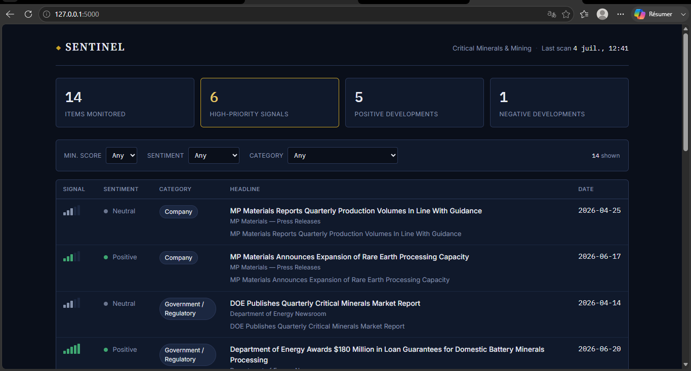
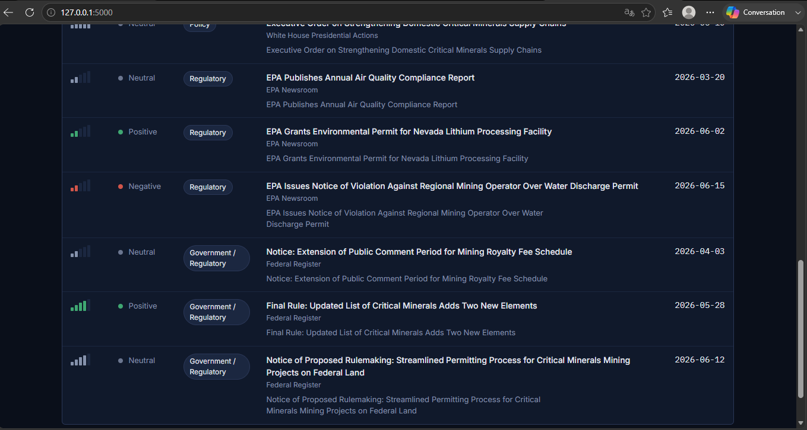

# Sentinel — AI-Powered Investment Intelligence & Alert System

[](https://github.com/MrBoyard7/sentinel-investment-intelligence/actions/workflows/ci.yml)
[](https://codecov.io/gh/MrBoyard7/sentinel-investment-intelligence)
[](LICENSE)
[](https://www.python.org/downloads/)
[](https://github.com/psf/black)

Sentinel monitors government, regulatory, legal, and industry sources for
developments relevant to a configurable investment theme, scores each item
for importance and sentiment with an LLM, stores everything in a
filterable dashboard, and raises alerts when something significant happens.

This repository is a self-contained implementation of the workflow
described below — built to be cloned and run end-to-end in under a minute,
with **no API keys and no network access required**, via a built-in demo
mode backed by local fixtures.

```
Source -> Collection -> AI Analysis -> Storage -> Dashboard -> Alert
```

First use case (configurable, see [Extending to a new theme](#extending-to-a-new-investment-theme)):
**critical minerals & mining** — permitting, government policy, and the
publicly traded companies exposed to these developments.

## Screenshots

The dashboard renders a filterable table of scored intelligence items, each
with a "signal strength" meter (1–5) instead of a bare number, colored by
sentiment:



- Stats strip: total items monitored, high-priority signal count, sentiment breakdown
- Filters: minimum score, sentiment, category
- Table: signal bars · sentiment · category chip · headline (linked to source) · date



Run `python -m sentinel.cli seed-demo && python -m sentinel.cli dashboard`
and open `http://127.0.0.1:5000` to see it live against the bundled demo data.

## Features

- **Multi-source collection** — RSS (`feedparser`) and web scraping
  (`requests` + `BeautifulSoup`), config-driven, no code changes to add a
  new source
- **Relevance pre-filter** — cheap keyword/company/agency matching runs
  before anything reaches the AI, controlling both cost and alert fatigue
- **AI scoring** — OpenAI JSON-mode scoring for importance (1–5), sentiment,
  category, summary, "why it matters," and recommended action, with a
  transparent deterministic fallback when no API key is configured
- **Dashboard** — server-rendered Flask app with client-side filtering,
  no build step required
- **Alerts** — email (SMTP), Slack (webhook), and SMS (Twilio REST API)
  for high-priority items, plus daily/weekly digests for everything else
- **Demo mode** — the entire pipeline runs offline against bundled fixture
  data, so the system is reviewable without any credentials
- **Tested** — `pytest` suite covering the relevance filter, the fallback
  scorer, and a full end-to-end pipeline run

## Quickstart

```bash
git clone https://github.com/MrBoyard7/sentinel-investment-intelligence.git
cd sentinel-investment-intelligence
python -m venv .venv && source .venv\Scripts\Activate.ps1
pip install -r requirements.txt

cp .env.example .env   # defaults to DEMO_MODE=true, no keys needed

python -m sentinel.cli seed-demo     # runs the pipeline against demo fixtures
python -m sentinel.cli dashboard     # http://127.0.0.1:5000
```

To run against real sources and a real OpenAI key, set `DEMO_MODE=false` in
`.env` and fill in `OPENAI_API_KEY` (and whichever alert channels you want:
SMTP, Slack webhook, Twilio). No code changes are required.

```bash
python -m sentinel.cli run                       # one pipeline pass
python -m sentinel.cli schedule --interval-minutes 30   # long-running scheduler
python -m sentinel.cli daily-digest              # send the daily digest now
python -m sentinel.cli weekly-digest             # send the weekly digest now
```

## Repository structure

```
sentinel-investment-intelligence/
├── README.md
├── LICENSE
├── .env.example
├── .gitignore
├── requirements.txt
├── requirements-dev.txt
├── .github/
│   └── workflows/
│       └── ci.yml              # runs pytest on every push / pull request
├── config/
│   ├── watchlist.yaml          # investment theme, keywords, companies, agencies
│   └── sources.yaml            # source definitions (RSS / scrape) + collection method
├── data/
│   ├── demo_fixtures/          # synthetic offline data powering DEMO_MODE
│   └── db/                     # SQLite database lives here at runtime (gitignored)
├── docs/
│   ├── architecture.md         # diagram + the required Source->...->Alert workflow example
│   └── design-rationale.md     # alert-fatigue prevention, extensibility, cost/timeline estimates
├── scripts/
│   ├── run_pipeline.py         # convenience wrapper around `sentinel.cli run`
│   └── seed_demo_data.py       # convenience wrapper around `sentinel.cli seed-demo`
├── sentinel/
│   ├── settings.py              # env vars + YAML config loader
│   ├── relevance.py             # keyword/company/agency relevance filter
│   ├── pipeline.py              # orchestrator: collect -> filter -> score -> store -> alert
│   ├── cli.py                   # command-line entry point
│   ├── collectors/
│   │   ├── base.py              # RawItem model + BaseCollector (with demo-mode fallback)
│   │   ├── rss_collector.py     # feedparser-based collector
│   │   └── web_scraper.py       # requests + BeautifulSoup collector
│   ├── ai/
│   │   ├── prompts.py           # system + user prompt templates
│   │   └── scorer.py            # OpenAI scoring + deterministic heuristic fallback
│   ├── storage/
│   │   ├── models.py            # SQLAlchemy `Item` model
│   │   └── database.py          # engine/session setup + query helpers
│   ├── alerts/
│   │   ├── email_alert.py       # SMTP email (with dry-run fallback)
│   │   ├── slack_alert.py       # Slack incoming webhook (with dry-run fallback)
│   │   ├── sms_alert.py         # Twilio REST API (with dry-run fallback)
│   │   └── digest.py            # immediate alert + daily/weekly digest composition
│   └── dashboard/
│       ├── app.py                # Flask app factory + JSON API
│       ├── templates/            # dashboard.html, base.html, _items_rows.html
│       └── static/                # style.css, dashboard.js
└── tests/
    ├── test_relevance.py
    ├── test_scorer.py
    ├── test_collectors.py
    └── test_pipeline.py
```

## Configuration

All theme- and source-specific configuration lives in two YAML files, kept
separate from code so a new deployment or a new theme never requires a
code change:

- **`config/watchlist.yaml`** — the investment theme name/description,
  keyword list, tracked companies (name + ticker), and always-in-scope
  government agencies. Also sets the default immediate-alert score
  threshold.
- **`config/sources.yaml`** — one entry per source: an id, display name,
  category, collection `type` (`rss` or `scrape`), the URL, and — for
  scraped sources — the CSS selectors used to extract items.

See `docs/architecture.md` for the full data flow and a worked example
answering the required screening question, and `docs/design-rationale.md`
for how false positives and alert fatigue are controlled, how this
architecture maps onto Make.com/Zapier/Airtable if a no-code build is
preferred, and rough cost/timeline estimates.

## Testing

```bash
pip install -r requirements-dev.txt
pytest -v --cov=sentinel --cov-report=term-missing
```

## Extending to a new investment theme

Duplicate `config/watchlist.yaml` and `config/sources.yaml` with new
keywords, companies, and sources, and point a new deployment at them —
no changes to `sentinel/collectors`, `sentinel/ai`, `sentinel/storage`,
`sentinel/dashboard`, or `sentinel/alerts` are required. See
`docs/design-rationale.md` for more detail.

## License

MIT — see [LICENSE](LICENSE).
