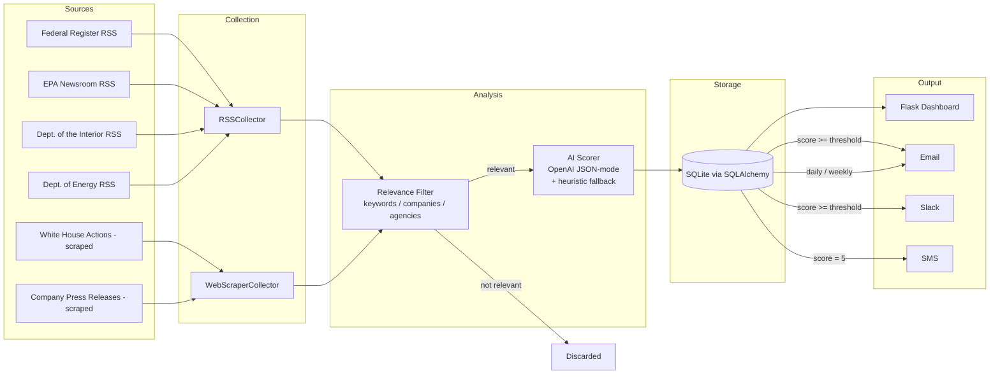

# Architecture

Sentinel implements a single, repeatable workflow:

```
Source -> Collection -> AI Analysis -> Storage -> Dashboard -> Alert
```

Every source, however different it looks (a government RSS feed, a scraped
press-release page, a future paid API), is normalized into the same
`RawItem` shape before anything else happens. Everything downstream of that
point — relevance filtering, AI scoring, storage, the dashboard, and
alerting — is completely source-agnostic. That separation is what makes
adding a 20th source a config change instead of a code change.

## Diagram



## Why these technology choices

| Concern | Choice | Rationale |
|---|---|---|
| Collection | `feedparser` for RSS, `requests` + `BeautifulSoup` for scraping | Covers the overwhelming majority of government and investor-relations publishing patterns without a headless browser |
| AI scoring | OpenAI `chat.completions` with `response_format: json_object` | Structured, parseable output; model is swappable via `OPENAI_MODEL` |
| Storage | SQLite via SQLAlchemy | Zero setup for a single-analyst deployment; the ORM layer makes a future move to Postgres a one-line engine URL change if the system needs concurrent writers |
| Dashboard | Server-rendered Flask + a small vanilla-JS filter layer | Fast first paint, no build step, easy for a non-frontend stakeholder to run locally |
| Scheduling | APScheduler (in-process) | Sufficient for a single-deployment cron-like schedule; a production rollout could swap this for a system cron job or a managed scheduler with no changes to `pipeline.py` |

## Demo mode

Every collector and the AI scorer check a single `DEMO_MODE` flag
(`sentinel/settings.py`). When enabled (the default, see `.env.example`):

- Collectors read from `data/demo_fixtures/<source_id>.json` instead of
  hitting the network.
- The AI scorer uses a transparent, deterministic heuristic
  (`sentinel/ai/scorer.py::_score_heuristic`) instead of calling OpenAI.

This means the entire pipeline — collection through to alerts appearing in
the dashboard — runs end to end with **no API keys and no network access**,
which is what makes this repository reviewable by simply cloning it:

```bash
pip install -r requirements.txt
python -m sentinel.cli seed-demo
python -m sentinel.cli dashboard
# open http://127.0.0.1:5000
```

Turning off demo mode (`DEMO_MODE=false` plus real credentials in `.env`) is
the only change required to point the exact same code at live sources and a
real OpenAI key.

## Answering the required screening question

> Please provide a sample workflow showing:
> Source -> Collection Method -> AI Analysis -> Dashboard -> Alert

Concrete example, using the code in this repository:

| Stage | This system |
|---|---|
| **Source** | Federal Register (`config/sources.yaml`, id `federal_register`) |
| **Collection Method** | `RSSCollector` polls the Federal Register's search RSS feed for the configured keyword set on a schedule (`sentinel/collectors/rss_collector.py`, run every `N` minutes by `pipeline.run_scheduler`) |
| **AI Analysis** | Each entry that survives the relevance filter is sent to `sentinel/ai/scorer.py`, which prompts the model (`sentinel/ai/prompts.py`) to return a JSON object with an importance score (1-5), sentiment, category, summary, "why it matters," and a recommended action |
| **Dashboard** | The scored item is written to SQLite (`sentinel/storage/database.py`) and immediately visible at `/` and via `/api/items`, filterable by score, sentiment, and category |
| **Alert** | If the score is at or above `IMMEDIATE_ALERT_SCORE` (default 4), `sentinel/alerts/digest.py::send_immediate_alert` fires an email and a Slack message immediately, and an SMS for score-5 items; everything else accumulates into the daily/weekly digest |

The same five-stage shape applies unchanged to EPA announcements (RSS), White
House executive orders (scraped), Department of the Interior announcements
(RSS), and company press releases (scraped) — only the `sources.yaml` entry
and the collector `type` differ.

## Mapping this architecture onto no-code platforms

The brief mentions Make.com, Zapier, Airtable, and Google Sheets as
acceptable building blocks. The five-stage architecture above is
platform-agnostic by design, so the same system can be assembled without
custom code if that is the preferred operating model for a given team:

| Stage | This repository | No-code equivalent |
|---|---|---|
| Collection | `RSSCollector` / `WebScraperCollector` | Make.com RSS module, or a scheduled HTTP module + a scraping add-on |
| Relevance filter | `sentinel/relevance.py` | Make.com Filter / Router on a Text Parser module matching watchlist keywords |
| AI Analysis | `sentinel/ai/scorer.py` | Make.com "OpenAI - Create a Chat Completion" module with the same JSON-mode prompt |
| Storage / Dashboard | SQLite + Flask | Airtable base (one table per the Dashboard Requirements columns) with an Airtable Interface as the dashboard |
| Alerts | `sentinel/alerts/*` | Make.com Gmail / Slack / Twilio SMS modules on the same score-based routing logic |

In practice, a no-code build trades lower initial engineering time for
higher per-execution cost and less flexibility in the relevance-filtering
and de-duplication logic. See `docs/design-rationale.md` for a fuller
discussion, including cost and timeline estimates for both approaches.
